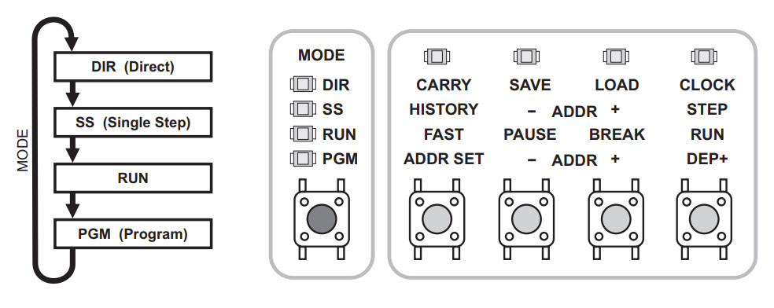
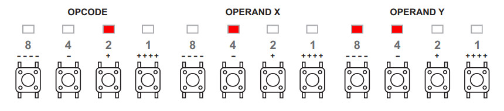
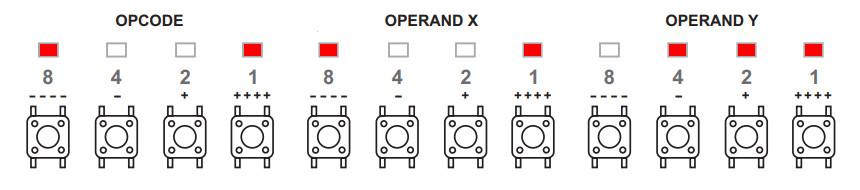
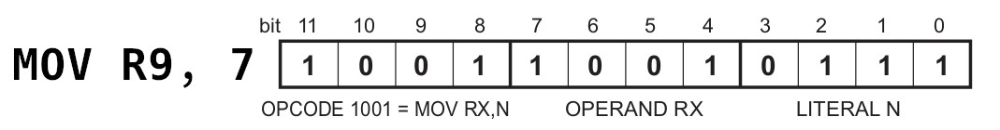
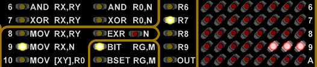
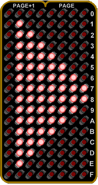

# In the Beginning...

Imagine it's the summer of 1975. A warm breeze blows through the window as you carefully slide the cover over the Altair 8800 you just finished building. You look down upon the rows of LEDs and switches, and realize with a sense of pride that you're likely the only person in your town that owns their own computer. You're truly living in the future, like Captain Kirk himself.

There's only one question now...what the hell do you do with it?

Just like those brave souls who sent away for their own Altair kit after seeing it in _Popular Electronics_, you've found yourself wondering just how you'll put your new high-tech toy to use. Don't worry, it's perfectly natural to be a bit confused. After all, it doesn't look much like any computer most of us have used in our lifetime. But make no mistake, it is a computer, and once you've learned how to use it, you'll be amazed at what it's capable of.

# Speaking the Language
While we've gone through considerable trouble to develop an assembler and emulator that will let you write and test code for the Supercon.6 badge using your modern computer, we believe there's a great benefit to entering a few programs directly on the badge itself using nothing but the buttons on the front panel.

To begin, turn the badge on by pressing the power button on the back. Then press the Mode button on the bottom left until the LED next to __PGM__ lights up.

This puts the badge into programming mode, where you'll enter instructions directly by using the three sets of four buttons, labeled OPCODE, OPERAND X, and OPERAND Y. To the extreme right you'll see a button labeled "Data In", and if it isn't already, you'll want to press that until the LED next to __BIN__ lights up. This will allow you to use the buttons to directly toggle binary bits, with each lit LED counting as a 1, and each dark LED a 0.

For example, to enter in the binary sequence ``0010 0100 1100``, the LEDs should look like so:

To actually enter the 12 bit instruction into the badge, you would press the button labeled __DEP+__. This will clear the LEDs over the rest of the buttons, resetting them for the next instruction. The __- ADDR +__ buttons can be used to step through the code line-by-line, allowing you to verify and correct any previous entries.

# Additional Modes
For the purposes of this document we're largely concerned with the __PGM__ (Programming) mode, but before we move on, a few words should be said about the badge's more advanced functions.

#### DIR (Direct)
In Direct mode, you're able to save and load programs from both the badge's internal flash and another device over a serial connection. It also allows you to experiment with various parts of the CPU, such as the Accumulator, X and Y Registers, Adder/Subtractor, Logic Group, and Flags. In this mode, instructions can be executed using the __Clock__ button.

For more information on __DIR__ mode, consult pages 18 - 22 of the manual.

#### SS (Single Step)
In Single Step mode, you can execute an entered program one instruction at a time. This is invaluable for debugging, as the LEDs on the badge will allow you see exactly what's happening inside of the CPU and in RAM. If your program isn't working as you expected, going through it in Single Step mode will likely help you figure out why.

For more information on __SS__ mode, consult pages 23 - 25 of the manual.

# One Small Step
Now that we have the basics out of the way, let's now enter a complete instruction into the badge and execute it.

With the badge in __PGM__ mode, we'll first clear any existing instructions by holding __ALT__ and pressing both __ADDR__ buttons together. Now, making sure the "Data In" selector on the bottom right of the badge is set to __BIN__, configure the LEDs as follows:

This corresponds to the following instruction, which will place the number 7 into the register R9:

After confirming the correct LEDs are lit, press the __DEP+__ button to deposit this instruction. Note that the LEDs over the buttons should turn off in preparation for the next instruction. Instead, press the MODE button until the LED next to __RUN__ lights up, and then press the button labeled __RUN__.

If you've done everything correctly, the LEDs on the badge should appear as they do in the image on the right.

There's actually a lot of information packed into these handful of LEDs, but for now, the important thing to note is that there are three red LEDs lit up on the right side of the LED matrix, next to the number 9. This indicates that, as per the instruction we entered, the number 7 (0111) has been stored in register 9.

Congratulations, you've officially run your first instruction on the 4-bit Supercon.6 badge! Feel free to take a break, and perhaps show off your accomplishment. When you're ready, click the arrow below to move on to the next lesson, and let's see if we can do something a little more interesting.

***

