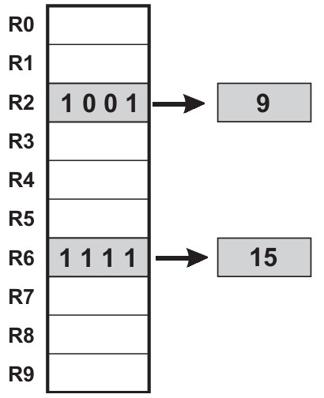
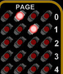

# Mathematic Operations
If you've made it this far, we'll assume you understand the basics of entering binary instructions into the Supercon.6 badge and executing them. Now, we're going to ramp things up a bit by chaining multiple instructions together into actual programs.

At the same time, we're going to start introducing new instructions which will aid you on your journey. There's a total of 31 opcodes, and while this basic introduction won't cover all of them, you should know just enough to be dangerous by the time we hit the end.

For now, let's start off with doing some basic math.

# Registers


Before we get to the hot digit-on-digit action, we need to talk about something pretty important: registers.

In modern parlance, you might think of these as variables. But it's more accurate to say that they are locations in memory where data can quickly be stored and recalled by the CPU. The 4-bit CPU in the Supercon.6 has 10 General Purpose Registers (R0 through R9), and a whole bunch of interesting Special Purpose registers that we won't get into right now. (Don't worry, there's a whole manual just for them.)

Most instructions will take at least one register as an argument, and some are actually hard-coded to only work with R0. That means to get anything done, you'll need to get comfortable with swapping data between registers.

With that out of the way, let's see how we can use registers to actually get things done on the badge.

# Addition

Beyond a literal one-liner, the following is one of the simplest programs possible: we're going to add two numbers together, and view the result. The code for that looks like this:
```
1001 0000 0010        mov r0, 2       ; Put 2 into R0
1001 0001 0010        mov r1, 2       ; Put 2 into R1
0001 0000 0001        add r0, r1      ; Add the two registers
```
On the left, we have the binary sequences that you can enter directly into your badge (go ahead, give it a shot), the center has the equivalent code in assembly, and finally to the right we have some descriptive comments.



After running this program, the badge's matrix should look like the image on the right. The four LEDs on each row correspond to the 4 bits held in each register, so the binary sequence in row 0 (0100) means the number 4 is currently in R0. The second row of LEDs (0010) show us that 2 is in R1.

Logically you might have expected the answer to our little addition program would have popped up on a third row, but the __add__ instruction only takes two registers, so that's all we've got to work with. Generally speaking, the result of any operation is going to be held in the first of the two registers, so in this case, we're left with a 4 in R0 and a 2 still lingering in R1.

Now, the astute reader may have noticed that in this program (much like in the single instruction demonstration from the previous lesson) we didn't give any command to actually output our result to the LED matrix. That's because the matrix isn't actually a display in the traditional sense -- it's a window into the working memory of the badge's CPU.

The matrix _can_ be used as a display by carefully manipulating the memory within its purview, which is something we'll get to later. For now, we'll just be directly viewing the contents of the registers.

# Subtraction
As you might expect, subtraction looks a lot like addition:

```
1001 0000 1100        mov r0, 12      ; Put 12 into R0
1001 0001 0111        mov r1, 7       ; Put 7 into R1
0011 0000 0001        sub r0, r1      ; Subtract R1 from R0
```

Running the program on your badge, we see that the LEDs next to R1 (0111) once again show that it's left with its original value of 7, while the LEDs for R0 (0101) show the result of 12 minus 7 to be 5.

# Increment/Decrement
As you start to write more complex programs, you'll often find the need to add or subtract 1 from a register -- such as when you want to keep track of how many times a loop has gone around. In fact, it's such a common task that the CPU has dedicated __inc__ (increment) and __dec__ (decrement) instructions for it.

Consider the following program:

```
1001 0000 0010        mov r0, 2     ; Put 1 into R0
1000 0001 0000        mov r1, r0    ; Copy R0 to R1
0000 0010 0000        inc r0        ; Add 1 to R0
0000 0010 0000        inc r0        ; Add 1 to R0
0000 0011 0001        dec r1        ; Sub 1 from R1
```

First we place 2 into R0, and then in the next line copy that over to R1, making them equal. We then run __inc__ on R0 twice, and __dec__ on R1.


When you run the program and look at the LEDs, you'll see that R0 now contains the result of 2 + 1 + 1, or 4 (0100). R1 on the other hand is down to 1 (0001), since we subtracted 1 from the original 2.

Technically you could accomplish the same thing with the __add__ and __sub__ instructions, but in those cases, you'd need to provide a second register that contained 1. On such a constrained system, that's a big ask, which is why the __inc__ and __dec__ instructions are so valuable.

# Multiplication
On the other side of the spectrum, multiplication is something you'll do relatively infrequently. In fact, there isn't even a multiply instruction. Of course, that doesn't mean we can't do it -- we've just got to think outside the box a bit.

For example, you might not have a command that will let you perform 5 x 3, but you can add 5 to itself repeatedly:

```
1001 0000 0101        mov r0, 5       ; Put 5 into R0
1000 0001 0000        mov r1, r0      ; Copy R0 to R1
0001 0000 0001        add r0, r1      ; Add (5 + 5)
0001 0000 0001        add r0, r1      ; Add again (5 + 5 + 5)
```

The result (15) will light up all four LEDs on R0, which incidentally makes it the largest number we can actually handle with these 4-bit instructions. There are technically some instructions that take 8-bit numbers, which we'll get to shortly.

# Division
Division can be done in much the same way, you just keeping subtracting the number until you hit zero. Of course, the trick there is keeping track of how many times you've subtracted the number, and checking if the result is zero or not.

Neither of these things are concepts we've covered yet, which makes this a logical place to introduce a new topic: _Program Flow_

***
<a href="2.Flow.md"></a>
