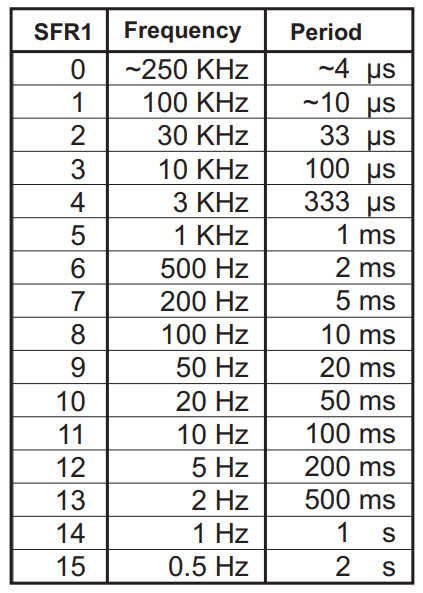
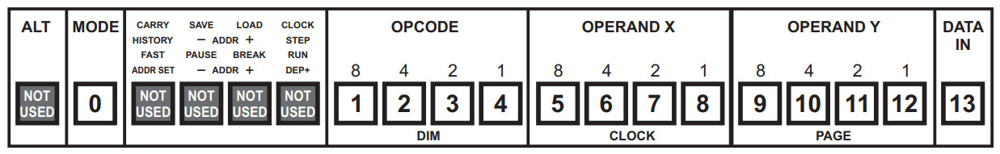
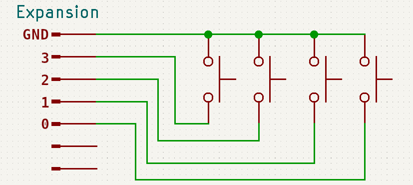
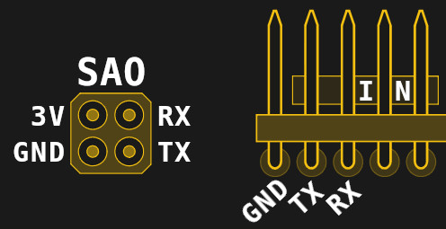

# Hardware I/O
As you've come to realize, compared to a modern computer, the Supercon.6 badge only offers the barest of necessities. But it does include some interesting onboard capabilities, and there's a whole host of system parameters that can be controlled from software. There's also a physical expansion port that features four input and four output pins, which can be used to connect the badge to other devices.

To truly see what the badge is capable of, you should consult the full documentation. Especially in regards to the Special Function Registers (SFRs) which allow you to modify the badge's configuration -- the topic actually has its own dedicated manual.

But to give you an idea of what's possible, let's take a look at some examples.

# Setting CPU Speed



If you've looked at the example programs for the badge, you'll know many of them start off with an instruction that sets the speed of the emulated 4-bit CPU. While the host PIC24FJ256 always runs at 16 MHz, the emulated CPU has 16 speed levels you can chose from.

There's no special instruction to set the CPU speed -- instead, you simply use __mov__ to write the desired setting to the Special Function Register 0xF0 in much the same way you would the General Purpose Registers R0 through R9. The same is generally true among the rest of the SFRs, which makes configuring the badge's hardware very straight-forward once you've consulted the documentation and know what the acceptable parameters are.

The following example demonstrates how the CPU's frequency can be changed on the fly, and how it impacts the speed of program execution:

```plaintext
1001 0000 1000        mov r0, 8       ; Put 8 into R0
1100 1111 0001        mov [0xF1], r0  ; Set CPU speed to 8 (100 Hz)

1001 0001 1111        mov r1, 15      ; Put 15 into R1
0000 0100 0001        dsz r1          ; Decrement R1 until 0
1111 1111 1110        jr -2           ; Jump back 2 lines

1001 0000 1100        mov r0, 12      ; Put 10 into R0
1100 1111 0001        mov [0xF1], r0  ; Set CPU speed to 12 (5 Hz)

1001 0001 1111        mov r1, 15      ; Repeat same loop as before
0000 0100 0001        dsz r1           
1111 1111 1110        jr -2            
```

In this example, we're using __dsz__ to count from 15 down to zero, first with the CPU frequency set to 100 Hz and then again at 5 Hz. Running this program, you should see the LEDs on row 1 blink rapidly for a little less than a second on the first go around. When the LEDs on row 1 come back and start counting down again, this it will take approximately 8 seconds to complete the loop.

# Generating Random Numbers
Given how few luxuries are included in the Supercon.6 badge, you might be surprised to find that it has an onboard system for generating high-quality (relatively speaking) random numbers.

It's more accurate to say that the badge has what's known as a _pseudorandom_ number generator (PRNG), because despite the clever tricks Voja implemented (you can read about the specific technique used on page 26 of the _Special Function Register_ manual) it's difficult to get truly random data without more specialized hardware. Still, the feature is a pleasant surprise that can definitely be handy for many programs.

To get yourself four bits of fresh randomness, you simply need to use __mov__ to read from the Special Function Register 0xFF:

```plaintext
1001 0000 1100        mov r0, 12        ; Set CPU speed to 12 (5 Hz)
1100 1111 0001        mov [0xF1], r0    ;

1001 0001 1111        mov r1, 15        ; Put 15 into R1
1101 1111 1111        mov r0, [0xFF]    ; Read from PRNG, put into R0
0000 0100 0001        dsz r1            ; Decrement R1 until 0
1111 1111 1101        jr -3             ; Jump back 3 lines
```

Running this program, you should see the LEDs on row 0 jumping between random values for several seconds, while the LEDs on row 1 count down from 15. Note that we only reduced the CPU speed to slow the process down and make it easier to visualize -- adjusting the CPU frequency is not necessary to read from the PRNG.

# Getting Button Status
To this point, all of our programs have run on their own with no user input. But should you actually want to hear from the user from time to time, there's a Special Function Register you can read to see which button on the face of the badge has been pressed.

Finding the last button pressed is as easy as doing a single __mov__ instruction to SFR 0xFD:

```plaintext
1101 1111 1101        mov r0, [0xFD]        ; Read last button pressed into R0
```

Run this one-line program, and you should notice that the LEDs in row 0 change each time you press a button on the front of the badge. You could experiment to figure out the value of each button, but thankfully that data has already been provided for us in the manual:



If you just want to know when a button has been pressed, but aren't necessarily worried about which one, there's a SFR for that as well: 0xFC

The trick with this one though is that the 4-bit value in 0xFC actually indicates four separate pieces of information, so you need to isolate each bit instead of just comparing the whole value. To do that we can use the aptly-named __bit__ instruction:

```plaintext
1001 0001 0000        mov r1, 0       ; Zero out R1
1101 1111 1100        mov R0, [0xFC]  ; Read key status into R0
0000 1001 0010        bit R0, 2       ; If second bit of R0 is 0, set Z flag
0000 1111 1001        skip z, 1       ; Skip next line if Z is set
1001 0001 1111        mov r1, 15      ; Put 15 into R1
```

This program checks the second bit of SFR 0xFC, which corresponds to the __AnyPress__ flag. Put simply, if that bit is 1, then one of the buttons on the badge is being pressed. The __bit__ command lets us check that specific bit, and __skip__ is being used to jump over the line that loads 15 into R1 should it read a 0.

The end result is that pressing any button (or at least, most) should cause all four LEDs on row 1 to light up.

# Using the Expansion Interface
The Supercon.6 badge features a 12-pin expansion connector which is used not only for programming the badge initially, but also offers four input pins and four output pins which can be easily controlled via software.

In fact, getting the status of the input pins is so simple that you don't _technically_ have to do anything to see it in action. Have you noticed that when programs are running on the badge, four LEDs on row B of the matrix always seem to be lit? That's actually the status of the four input pins -- if you short any of those pins to ground, its corresponding light will go out.

Using the __bit__ instruction against the SFR 0x0B will let you pull this information into your programs:

```plaintext
1001 0001 0000        mov r1, 0       ; Zero out R1
1101 0000 1011        mov r0, [0x0B]  ; Read input pin status into R0
0000 1001 0001        bit r0, 1       ; If first bit of R0 is 0, set Z flag
0000 1111 1101        skip nz, 1      ; Skip next line if Z is NOT set
1001 0001 1111        mov r1, 15      ; Put 15 into R1
```

With this program running, shorting out the input pin 1 on the expansion connector to ground should cause 4 LEDs to light up on row 1. Each bit in 0x0B corresponds to its own pin, so wiring up four additional buttons on your badge is quite straightforward:



Using the output side of the expansion connector is much the same, except instead of reading from the individual bits of SFR 0x0B, you'll be writing to the bits of 0x0A using either the __bset__ instruction to set them directly or the __btg__ instruction to invert their current state.

# Communicating over UART
Ask any hardware hacker and they'll tell you the same -- it's not a proper computer unless it has a serial port, and the Supercon.6 badge is no exception. Not only will you use the UART capabilities of the badge to upload and download programs from other badges or your "real" computer, it can also be used for arbitrary communication with all sorts of interesting gadgets.



Compared to performing many other functions, the process of transmitting and receiving data over UART is actually quite a bit easier than you're probably expecting. If there's a trick, it's that for each byte you send out over the wire, you need to make two separate writes -- the first 4 bits go into SFR 0xF7 and the other 4 into SFR 0xF6. Once the second half of the byte has been written to 0xF6, it will automatically be transmitted.

It's also worth mentioning that, by default, the badge uses the SAO header for UART and _not_ the pins in the expansion header. This behavior can be changed in the configuration, but for the sake of simplicity, we'll leave it at the default for this example.

___Note:__ As of this writing (Nov 4th), a bug in the badge firmware prevents the UART pins in the expansion header from functioning properly. This will be addressed in an update, but in the meantime, the SAO pins do work as expected._

As a basic example, let's look at the following program which will send the ASCII letter "A" out continuously over UART:

```plaintext
1001 0010 0100        mov r2, 0b0100    ; High nibble of ASCII "A"
1001 0011 0001        mov r3, 0b0001    ; Low nibble of ASCII "A"

1000 0000 0010        mov r0, r2        ; Write high nibble to UART
1100 1111 0111        mov [0xF7], r0    ;
1000 0000 0011        mov r0, r3        ; Write low nibble to UART
1100 1111 0110        mov [0xF6], r0    ; Transmit
```

The operation is simple in principle...but in practice you can see how difficult it would be to send any serious message using just the General Purpose Registers. To make any real use of the UART, you're going to need a more efficient way of shoving around data than we've looked at so far.

Sounds like the perfect time to move onto the next chapter: _Memory_

***
<a href="4.Memory.md"></a>
