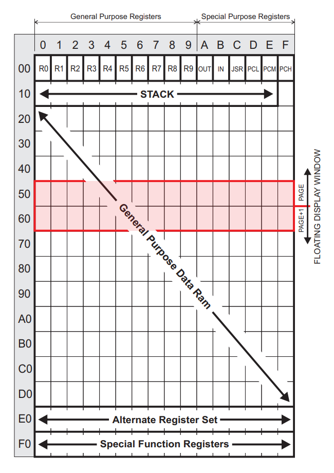

# Manipulating Memory



So far, we've been mainly concerned with the General Purpose Registers R0 through R9, and a handful of the Special Function Registers (SFRs) that allow us to poke and prod at the inner workings of the badge. For a great many tasks, this is sufficient.

But to get the most out of the badge, you'll need to know a bit more about addressing and handling its memory. If you've got large (relatively speaking) amounts of data you want to stash away and recover later, the General Purpose Registers simply aren't going to cut it. Luckily for us, there's a sizable swath of RAM sandwiched between the common and special registers that we're able to utilize.

As you can see in the image to the right, the memory of the Supercon.6 badge can be thought of as a sort of spreadsheet. We've used friendly names like R0 and R1 to refer to cells in this spreadsheet so far, which the CPU's instructions have been largely designed around for ease of use. But there are variations of the instructions which allow for different ways of addressing those locations.

In the following examples, we're going to look at some of the more advanced ways of utilizing the memory on the Supercon.6 badge, and the capabilities it can unlock.

# Direct Memory Addressing
While it's true that some instructions are setup in such a way that they can only be used with a specific register (often R0), it's important to understand that there's nothing inherently unique about the registers we've become accustomed to using in this document. When you see R0 or R1 in a program, what you're essentially looking at is a bookmark that points to a particular location in the badge's memory. It's a handy thing for us humans, but as far the CPU is concerned, memory is memory.

As such, there are special variants of instructions like __mov__ which can be pointed to an arbitrary memory location. While using these takes a bit more effort on the programmer's part, as you need to keep track of where you're stashing your data, it doesn't have much of an impact on the code itself:

```
1001 0000 1100        mov r0, 12        ; First put value in R0
1100 0001 0011        mov [19], r0      ; Move into memory location
                     
1001 0000 1111        mov r0, 15        ; Put new value into R0
1100 0001 0100        mov [20], r0      ; Copy to sequential locations
1100 0001 0101        mov [21], r0      ; Note different mov opcode
1100 0001 0110        mov [22], r0      ;

1101 0001 0101        mov r0, [21]      ; Read value from memory into R0
```

You still need to move the value into R0 temporarily when storing or recalling it, but for data that you don't need to access frequently, this is a great way to free up your named registers for higher priority tasks.

# Indirect Memory Addressing
Directly addressing memory is handy, but it has its limitations. Specifically, you still have to hard-code the values you want to address. In many cases that's not a huge problem, but it would be more efficient to loop through a read or write operation while simply iterating the memory address.

As it so happens, there's a version of __mov__ which allows us to do exactly that. This instruction takes two registers as its input, representing the high and low nibble of the desired address. This not only enables the expression of 8 bit memory address (0 to 255), but allows you to manipulate the desired address using the instructions we've already learned.

In this context, it helps to think of the registers as the indexes in a two-dimensional array: with the first register representing the desired column, and the second the row. This also happens to be how the LED matrix is arranged...a very convenient relationship, but we'll get to that in a moment. 

Let's look at this example, which can quickly fill a block of memory with a desired value:

```
1001 0000 1111        mov r0, 15       ; First put value in R0
                     
1001 0001 0001        mov r1, 1        ; Page 1 of memory
1001 0010 1110        mov r2, 14       ; Start at row 15 so we can use dsz
                     
1010 0001 0010        mov [r1:r2], r0  ; Provide dimensions to mov
0000 0100 0010        dsz r2           ; Loop to fill 14 addresses
1111 1111 1101        jr -3            ;
                     
1001 0000 0000        mov r0, 0        ; Direct addressing
1100 0001 1011        mov [1:11], r0   ; in two dimensions             
```

After running this program, you should see that around 3/4 of the left side of the LED matrix is fully filled, representing the 10 memory locations in which we deposited the value 15. Not bad for three lines of code. One of the rows will also be empty, which is the result of the last line, which demonstrates directly addressing a memory location in two dimensions.

Of course you should also have noticed that, if it wasn't for the handful of lit LEDs on the right side of the matrix cluttering things up, the display would be showing a perfect exclamation mark...

Which means we're ready to combine everything we've learned so far and tackle the final challenge of our journey: _Graphics_.

***
<a href="5.Graphics.md"></a>