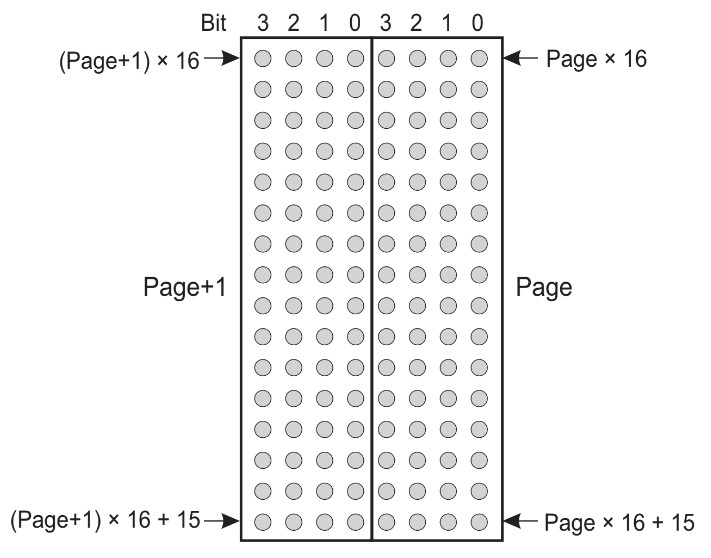
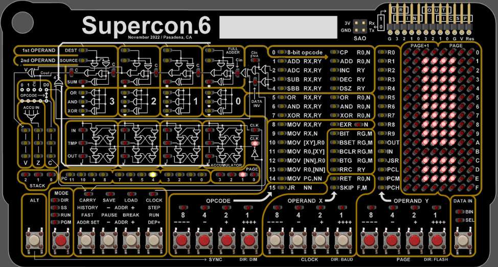
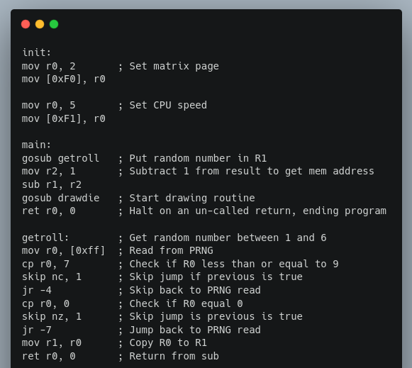

# Graphics
As covered previously in this document, and as you've at this point seen for yourself, the LED matrix on the Supercon.6 badge isn't a display in the traditional sense.



Instead it's a live window into the memory of the computer, which expresses the binary values in each nibble of memory with four LEDs. Paired with the badge's Single Step mode, it offers a phenomenal level of transparency when you're working with your programs, as it lets you see in real-time when each and every bit has been changed.

But even though there's no turn-key method of displaying images or text on the LED matrix, it's not hard to imagine how it could be pressed into service as a general purpose output device. After all, we've now seen how to directly manipulate values in memory, and we know how the LEDs will light in response to those values. If you combine that with the methods of program flow control like loops, skips, and jumps that we learned earlier, it's possible to "draw" rudimentary images using the 16x8 LED array.

# Clearing the Screen (Setting Memory Page)

There's an obvious problem with this idea though, as all of our General Purpose Registers, and even some of the Special Function Registers (SFRs) are already visible on the matrix and taking up space on our "screen" that we can't afford to lose given the extreme low resolution we're working with.

Luckily, there's a simple solution to this problem: SFR 0xF0 allows us to change which area of memory the matrix examines. So with just a single instruction we can point the matrix at a fresh "page" where the only data that appears is what we've intentionally placed there:

```
1001 0000 0010        mov r0, 2        ; Move matrix over to page 2
1100 1111 0000        mov [0xF0], r0   ; 
```

After running this program, you might think nothing happened. But a close look at the matrix will show that every single LED is turned off; a condition that until this point, you would have never seen while a program was running. That's not because we've disabled it, we've simply pointed it at an unused area of RAM, so there's nothing to show.

Which means the only thing left to do is fill that RAM with something interesting to look at.

# Exclamation (Revisited)

Armed with this new knowledge, you could go back to the previous example and draw that exclamation mark with a nice clean background. But it would would still be off-center, because each side of the matrix is only showing one page of RAM.

To fix this, we'll need to store each half of our sprite in a separate register, and then use a loop and indirect memory addressing to draw it out:

```
1001 0000 0010        mov r0, 2        ; Move to page 2
1100 1111 0000        mov [0xF0], r0
                     
1001 0101 0011        mov r5, 0b0011   ; Left side of icon 
1001 0110 1100        mov r6, 0b1100   ; Right side of icon
                     
1001 0010 0010        mov r2, 2        ; Register for page 2
1001 0011 0011        mov r3, 3        ; Register for page 3
1001 0100 1110        mov r4, 14       ; Start at row 14
                     
1000 0000 0101        mov r0, r5       ; Get left side data into R0
1010 0011 0100        mov [r3:r4], r0  ; Draw left side
1000 0000 0110        mov r0, r6       ; Get right side data into R0
1010 0010 0100        mov [r2:r4], r0  ; Draw right side
0000 0100 0100        dsz r4           ; Decrement row
1111 1111 1010        jr -6            ; Draw 14 rows
                     
1001 0000 0000        mov r0, 0        ; Clear line at bottom
1100 0011 1011        mov [3:11], r0   ;  
1100 0010 1011        mov [2:11], r0   ;
```

If the program works correctly, you should have a big exclamation mark in the exact center of your matrix.



With some imagination, and a careful tally of where all your bits are in memory, this basic technique can be used to write out text or display simplistic images. By reading the status of the badge buttons, they could even be made to move.

We can't wait to see who's the first to create a _Snake_ or _Tetris_ clone for their badge.


# Das Blinkenlights

If you've followed along through this whole guide, congratulations. In a relatively short period of time, you've gone from kindergarten-level arithmetic to drawing images by directly manipulating bits in memory; and you've done it all with nothing more exotic than a handful of tactile buttons and a few (hundred) LEDs.

In honor of this accomplishment, the final program combines a little bit of everything covered in the previous lessons to produce a visually impressive "screen saver" for your badge. We'd love to see you keep it up and running as you navigate the con -- wearable proof that you don't need gigabytes of RAM and 16 cores (or a keyboard and monitor, for that matter) to hack hardware.

You might have walked into the 2022 Hackaday Supercon without any first-hand experience in bare metal programming, but that's certainly not the way you're leaving.

```
1001 0000 0011        mov r0, 3        ; Set CPU speed
1100 1111 0001        mov [0xF1], r0   ;
                     
1001 0000 0010        mov r0, 2        ; Set matrix page
1100 1111 0000        mov [0xF0], r0   ;
                     
1001 0010 0010        mov r2, 2        ; Set memory row and columns 
1001 0011 0011        mov r3, 3        ;
1001 0100 0000        mov r4, 0        ;
                     
1101 1111 1111        mov r0, [0xFF]   ; Read random number
1010 0011 0100        mov [r3:r4], r0  ; Move into position on matrix
1101 1111 1111        mov r0, [0xFF]   ;
1010 0010 0100        mov [r2:r4], r0  ; Repeat for other side
1000 0000 0100        mov r0, r4       ;
0000 0000 1111        cp r0, 15        ; Check row count
0000 0010 0100        inc r4           ; Move to next row
0000 1111 1001        skip z, 1        ; Skip after row 15
1111 1111 0111        jr -9            ; Loop forever
```

Sorry, no spoiler image this time. If you want to see what the output of this particular program looks like, you've got to get those thumbs working.

# The End is Only the Beginning

Don't think that just because you worked through this guide that you've mastered the Supercon.6 badge. Far from it -- we've barely scratched the surface of what this machine is capable of. There are many important concepts that, for the sake of brevity, simply aren't included in this tutorial. It's up to you the reader, with your newfound respect for low-level programming, to see where this badge takes you from here.



If you're looking to continue this journey, take a look at the powerful assembler we've put together, which will allow you to write programs for the badge using your favorite text editor and send them over with a common USB-to-serial adapter. Don't worry if you didn't bring one -- we should have plenty of hanging around. Though having an excuse to tap your neighbor on the shoulder and ask if you can borrow their adapter isn't a bad way to strike up a conversation at Supercon.

The assembler not only saves you from having to literally thumb all of your programs in, it also unlocks powerful pseudo-instructions such as __goto__ and __gosub__, which combined with the ability to label sections of your code, is a transformative kick in the pants. There's even some provisions made for storing and recalling graphics data, a welcome capability for anyone looking to bring some games to the badge.

But whether you chose to switch over to the assembler and enjoy a slightly more modern software development paradigm, or stick with your trusty thumbs and LEDs that can tell no lies, the important thing is that you keep on hacking.
