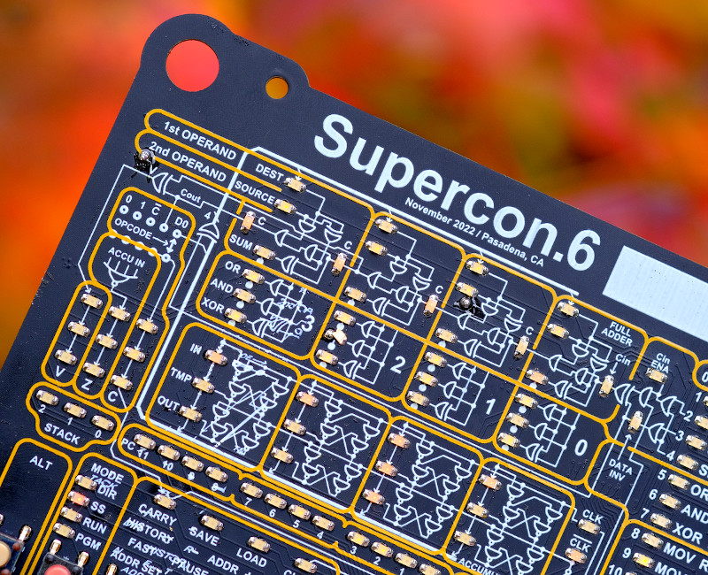

# Supercon.6 Badge Guided Tutorial
This year's badge, by design, presents you with a spartan low-level development environment that's akin to working with a 1970s minicomputer. Compared to the incredibly powerful hardware we're used to developing software for, the limitations of this 4-bit badge will be a rude awakening for many. But for those that conquer this faux-retro computer, enlightenment awaits.

You'll learn more about how a computer works in an afternoon of hacking around on this badge than you will in a year of copying somebody's Python code off of Stack Overflow. We're going to be starting at the beginning, by feeding your new digital friend only the finest hand-picked 1s and 0s. Once you've got your head wrapped around speaking to a computer in its native tongue, the rest will come quickly.

Pretty soon you'll know what's in each bit of memory, and why. Optimization will become second nature, because bloat doesn't really exist on a CPU with just 31 instructions. You may even find yourself capable of seeing data and patterns in a row of blinking LEDs like some kind of off-brand Neo.

Are you ready to see how deep the rabbit hole goes?

# Using This Guide
The example programs in this directory, and the accompanying documentation, assume you have no prior knowledge of working with low-level hardware development or assembly code. If this doesn't describe you, then you may be better off getting familiar with the system by reading through some of the long-form examples we've prepared, as well as the phenomenal documentation put together by the badge's creator, Voja Antonic.

But if you're ready to start at the beginning, simply click the first file in the listing above and follow along. Each example program in this document is displayed both as binary sequences that can be directly entered into the badge, and the human-readable assembly equivalent. They have all been tested on real hardware, and known to work as expected.

For best results, we recommend loading a pair of fresh AAs into that new badge of yours, and keeping it handy as we move along. Reading about it will only get you so far, to really understand whats happening, you should actually be entering the programs into your badge and seeing how it responds.
